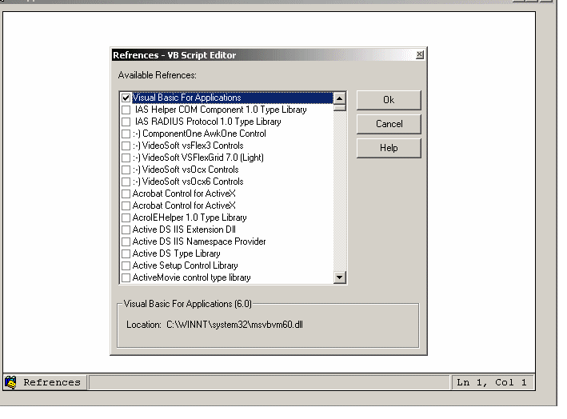



## VbScript Editor With Intellisense

### Description

Intellisense in scripting languages like vbscript is like a dream for script programmers. This goal of this project is to provide vbscript editor with intellisense like it was available in most of Microsoft language editor. The control uses the type library refrence to explore the public methods and function exposed in any com library. The script developer has to code like vb 6.0 language (Dim pConnection as ADODB.Connection) and the editor will automatically convert the code into vbscript.

The complete vbscript alone with added references can be saved as xml file. The Script property of control will return the pure vbscript which can be executed using the Microsoft Script Control.
 
### More Info
 
How to run the code :

Open the group project and press F5 vbScriptEditor_Group.vbg

If the project says missing Edanmo&#8217;s OLE Interface&#8230;. Then add reference to olelib.tlb in TypeLib folder

Below is the output of Script Editor

Dim pConnection 'As ADODB.Connection

Dim pRecordset 'As ADODB.Recordset

Set pConnection = CreateObject("ADODB.Connection")

pConnection.Open("Query String Here","User ID","Password")

Set pRecordset = pConnection.Open("SQL Query Here")

MsgBox(pRecordset.RecordCount)

Developer continues to code like in vb 6.0 and the editor automatically convert the syntax to vbscript.

For example developer code

Dim pConnection As ADODB.Connection

And the editor will convert it to

Dim pConnection 'As ADODB.Connection

Which is equivalent to

Dim pConnection in vbScript

             |
---                |---
**Submitted On**   |2007-01-23 13:42:36
**By**             |[Rajneesh Noonia](https://github.com/Planet-Source-Code/PSCIndex/blob/master/ByAuthor/rajneesh-noonia.md)
**Level**          |Advanced
**User Rating**    |4.7 (71 globes from 15 users)
**Compatibility**  |VB 5\.0, VB 6\.0, VB Script, ASP \(Active Server Pages\) 
**Category**       |[Custom Controls/ Forms/  Menus](https://github.com/Planet-Source-Code/PSCIndex/blob/master/ByCategory/custom-controls-forms-menus__1-4.md)
**World**          |[Visual Basic](https://github.com/Planet-Source-Code/PSCIndex/blob/master/ByWorld/visual-basic.md)
**Archive File**   |[VbScript\_E2079348132007\.zip](https://github.com/Planet-Source-Code/rajneesh-noonia-vbscript-editor-with-intellisense__1-69148/archive/master.zip)

